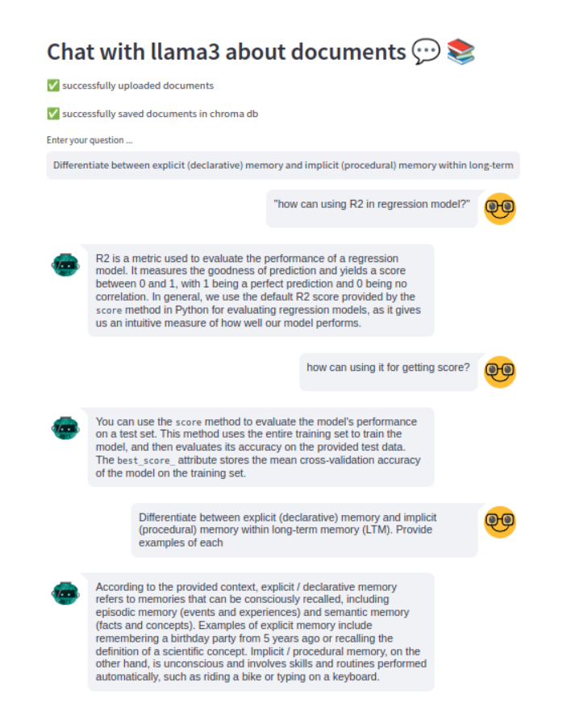
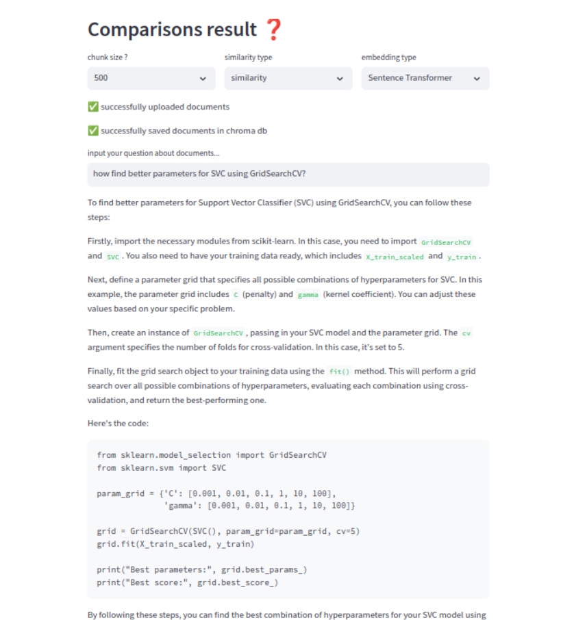
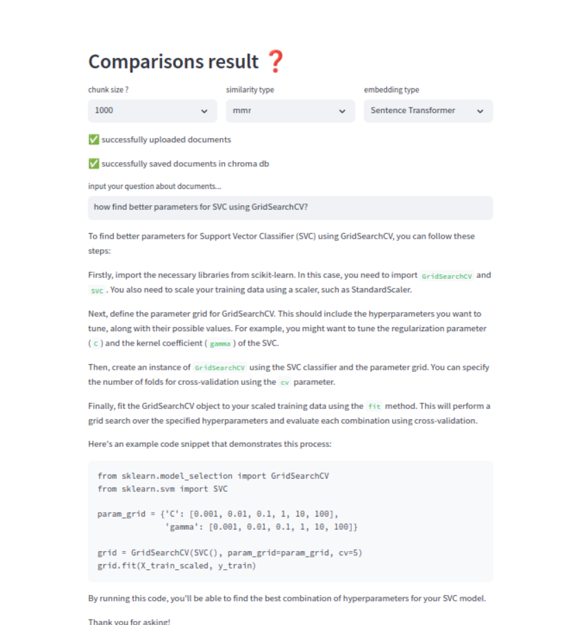
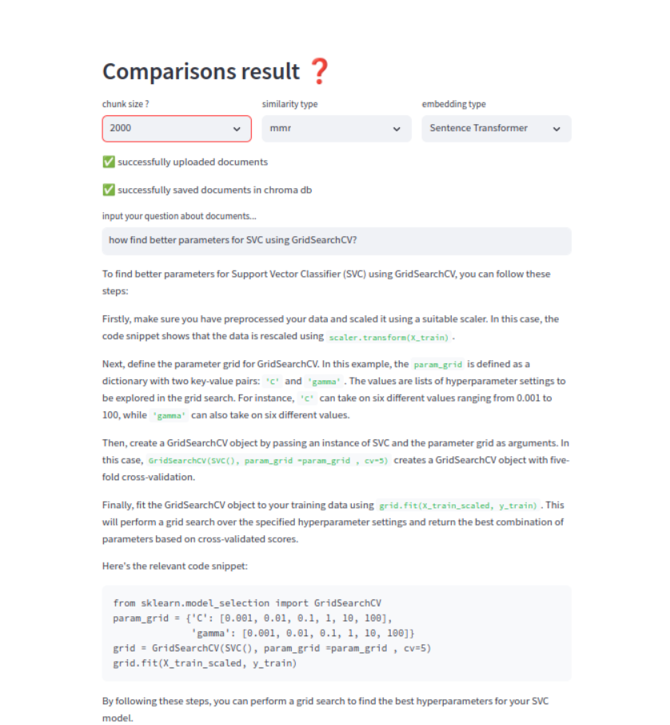

# Chatbot-Llama3 💬 📚
chatbot with history using Llama3
this task for create chatbot with history using llama3 and comparing the result when change:

1. **chunk size** 
    - small chunk (500)
    - medium chunk (1000)
    - large chunk (2000)


2. **embedding model** 
    - sentence_transformers
    - BERT
    - GPT

3. **similarity type**
    - cosine
    - dotProduct


## Requirements
python 3.8 or later

Enviroment
    
anaconda /visual studio code 

cd in path-folder

### Install 
```bash
$ pip install -r requirements.txt
```
```bash
$ steamlit run src/app.py 
```
## Deployment & use case

 ### 1- **Chatbot_history** 🤖

 
#### Using streamlit chat for deployment
- get data from url & pfd file
- split documentaion to chunks
- save this chunks to chroma db
- when question in input chat then search similarty in chroma db and response chunks
- The possibility of obtaining an answer when the question relates to previous questions, which means saving the conversation in this session  

 ### 2- **Comparisons result** ❓

 

 

 

- Get answer the question with choose
    - type of similarity 
    - embedding model 
    - chunk size 
- Compare results 

